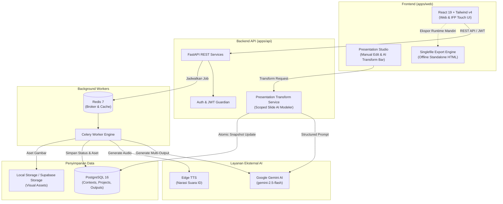

# PahamIn (Paham Interaktif)

> **Platform Pembuat Media Pembelajaran Berbantuan AI Terintegrasi untuk Guru Sekolah Dasar Indonesia**

PahamIn membantu guru Sekolah Dasar mewujudkan pembelajaran yang kontekstual, berdiferensiasi, dan interaktif sesuai semangat **Kurikulum Merdeka**. Hanya dari satu formulir konteks pembelajaran, guru dapat secara paralel memproduksi tiga media ajar terpadu: **Slide Presentasi Interaktif untuk Layar Sentuh (*Interactive Flat Panel / IFP TV*)**, **LKPD Cetak Berjenjang (*Teaching at the Right Level / TaRL*)**, dan **E-Book Cerita Kontekstual Siswa**.

Dilengkapi dengan **Presentation Studio** yang memungkinkan peninjauan instan, penyuntingan manual, serta **AI Transform Bar** untuk menyempurnakan atau menambah slide menggunakan instruksi bahasa alami (*natural language*).

---

## ✨ Fitur Utama

- **Konteks Pembelajaran Berakar Budaya Lokal (Tahap 1)**:
  - Penyesuaian materi otomatis berdasarkan Fase fondasi (Fase A: Kelas 1–2, Fase B: Kelas 3–4, Fase C: Kelas 5–6).
  - Integrasi capaian pembelajaran, kondisi geografis (pesisir, pegunungan, perkotaan, agraris), dan kearifan lokal daerah setempat.
- **Pipeline Generasi Media Paralel (Tahap 2 & 3)**:
  - Generasi terstruktur (JSON schema) berbasis **Google Gemini 2.5** yang dijalankan secara *asynchronous* melalui antrean **Celery & Redis**.
  - Tiga output dihasilkan sekaligus dari satu konteks tanpa inkonsistensi materi antar media.
- **Presentation Studio & AI Transform Engine (Fitur Baru)**:
  - **Mode Tayang Interaktif (IFP TV Runtime)**: Antarmuka layar sentuh dengan navigasi intuitif, tombol interaksi virtual, kuis langsung, dan catatan panduan guru (*teacher notes*).
  - **AI Transform Bar**: Ubah isi, sederhanakan konsep rumit, perbaiki tata bahasa, atau tambahkan kuis interaktif pada slide aktif cukup dengan mengetik instruksi (misal: *"Buat penjelasan lebih sederhana untuk anak kelas 2"* atau *"Tambahkan kuis pilihan ganda tentang topik ini"*).
  - **Manual Slide Editor & Management**: Dialog instan untuk menyunting judul materi, poin penjelasan, aset visual, dan naskah bicara guru; serta fitur tambah/hapus slide.
  - **Narasi Suara Sintetis (Text-to-Speech)**: Generator audio naskah guru berbasis Edge TTS berbahasa Indonesia alami.
  - **Ekspor Mandiri (*Standalone Single-File*)**: Ekspor presentasi ke dalam satu file HTML mandiri (`.html`) yang dapat dipindahkan ke flashdisk dan diputar langsung di TV sekolah tanpa memerlukan akses internet atau instalasi software tambahan.
- **LKPD Cetak & Diferensiasi TaRL**:
  - Lembar aktivitas berjenjang 3 tingkat kemahiran siswa: *Perlu Bimbingan*, *Cukup Mahir*, dan *Sangat Mahir*.
  - Desain ramah cetak dan ekspor langsung ke dokumen PDF siap pakai.
- **Buku Cerita Digital (E-Book)**:
  - E-Book kontekstual bergambar dengan rubrik evaluasi pemahaman mandiri siswa.
- **Autentikasi & Keamanan Data Guru**:
  - Proteksi akun guru menggunakan enkripsi password *bcrypt* dan otorisasi sesi berbasis *Bearer JWT*.

---

## 🏗️ Arsitektur Sistem



### Komponen Sistem

| Komponen | Peran | Teknologi |
|---|---|---|
| `apps/web` | Portal web guru, wizard proyek, studio penyuntingan slide, dan runtime IFP | React 19, TypeScript 6, Vite 8, TailwindCSS v4, Base UI, Framer Motion |
| `apps/api` | REST API, autentikasi, validasi Pydantic, orkestrasi AI transform, dan ekspor | FastAPI, SQLAlchemy (Async), Alembic, Structlog |
| `worker` | Eksekusi pipeline generasi media paralel di latar belakang | Python, Celery |
| `db` | Penyimpanan persisten guru, konteks, proyek media, dan riwayat output | PostgreSQL 16 |
| `redis` | Message broker antrean pekerjaan dan result backend Celery | Redis 7 |
| Layanan Eksternal | Pemrosesan LLM terstruktur, sintesis suara, dan penyimpanan aset | Google Gemini (`gemini-2.5-flash`), Edge TTS, Supabase Storage |

Dokumen desain arsitektur, ERD, dan spesifikasi pipeline lengkap tersedia di [docs/ARCHITECTURE.md](docs/ARCHITECTURE.md).

---

## 📋 Prasyarat Sistem

- **Docker & Docker Compose** (metode paling direkomendasikan):
  - Docker Engine v24+ atau Docker Desktop dengan Docker Compose v2.
- **Kunci API Google Gemini**:
  - Dapatkan Google Gemini API key gratis melalui [Google AI Studio](https://aistudio.google.com/).
- **Untuk Pengembangan Lokal (Tanpa Docker penuh)**:
  - Node.js 22+ & Corepack / pnpm 10+
  - Python 3.11+
  - PostgreSQL 16 & Redis 7

---

## 🐳 Panduan Cepat dengan Docker Compose

### 1. Kloning Repository & Siapkan Environment

```bash
git clone https://github.com/matchaoreolate/hology_pahamin_ifp.git
cd hology_pahamin_ifp

# Salin file konfigurasi environment
cp apps/api/.env.example apps/api/.env
```

### 2. Konfigurasi Variabel Wajib

Buka file `apps/api/.env` dan lengkapi konfigurasi minimum berikut:

```dotenv
SECRET_KEY=masukkan_string_acak_rahasia_minimal_32_karakter
GEMINI_API_KEY=masukkan_gemini_api_key_anda
```

### 3. Bangun dan Jalankan Semua Container

```bash
docker compose up --build -d
```

### 4. Jalankan Migrasi Basis Data

Setelah container `api` dan `db` aktif, jalankan migrasi Alembic:

```bash
docker compose exec api alembic upgrade head
```

### 5. Akses Layanan

| Layanan | Alamat URL | Keterangan |
|---|---|---|
| **Aplikasi Web** | [http://localhost:8081](http://localhost:8081) | Antarmuka guru & runtime IFP TV |
| **Dokumentasi OpenAPI (Swagger)** | [http://localhost:8000/docs](http://localhost:8000/docs) | Eksplorasi & uji coba interaktif REST API |
| **ReDoc API** | [http://localhost:8000/redoc](http://localhost:8000/redoc) | Dokumentasi teknis API |
| **API Health Check** | [http://localhost:8000/health](http://localhost:8000/health) | Status kesehatan backend |
| **Flower (Celery Monitor)** | [http://localhost:5555](http://localhost:5555) | Pemantau task antrean worker (`dev` profile) |

> **Tips Pemantau Celery**: Untuk mengaktifkan dashboard monitoring Celery Flower, jalankan dengan profil dev:  
> `docker compose --profile dev up --build -d` (Kredensial login: user `admin` / pass `pahamin123`).

Untuk menghentikan seluruh layanan:
```bash
docker compose down
```

---

## 💻 Panduan Pengembangan Lokal (Monorepo)

### 1. Menjalankan Frontend Web

```bash
# Aktifkan Corepack dan pasang dependensi dari root
corepack enable
pnpm install

# Jalankan server pengembangan Vite
pnpm dev:web
```
Frontend lokal akan berjalan di: **http://localhost:5173** (otomatis terhubung ke backend `http://localhost:8000/api/v1`).

### 2. Menjalankan Database & Redis

Gunakan Docker Compose untuk menjalankan basis data dan broker dengan praktis:

```bash
docker compose up -d db redis
```

### 3. Menjalankan Backend API

Di terminal baru, masuk ke folder backend:

```bash
cd apps/api
cp .env.example .env

# Buat virtual environment Python 3.11
python3.11 -m venv .venv
source .venv/bin/activate

# Pasang dependensi
pip install -e ".[dev]" aiosqlite

# Jalankan migrasi database
alembic upgrade head

# Jalankan server API dengan live reload
uvicorn app.main:app --reload --host 0.0.0.0 --port 8000
```

### 4. Menjalankan Celery Worker

Buka terminal baru dengan virtual environment backend yang sama aktif:

```bash
cd apps/api
source .venv/bin/activate

# Jalankan worker pemroses generasi media
celery -A app.tasks.celery_app worker --loglevel=info --queues=generate
```

---

## 🧪 Pengujian Otomatis

### Pengujian Backend

Seluruh pengujian unit dan integrasi backend menggunakan **SQLite in-memory** (`sqlite+aiosqlite`) yang terisolasi sepenuhnya. Pengujian tidak membutuhkan koneksi database luar, Redis, maupun kuota API Gemini eksternal.

```bash
cd apps/api

# Jalankan seluruh rangkaian test
pytest

# Jalankan test dengan ringkasan coverage
pytest --cov=app --cov-report=term-missing

# Jalankan pengujian khusus Presentation AI Transform
pytest tests/api/test_presentation_transform.py -v
```

### Pengujian Frontend

```bash
# Linting kode frontend dengan Oxlint
pnpm --filter @pahamin/web lint

# Verifikasi build production & ekspor single-file
pnpm --filter @pahamin/web build
```

---

## 🧭 Ringkasan Endpoint REST API (v1)

```text
AUTENTIKASI
POST   /api/v1/auth/register                      # Registrasi akun guru baru
POST   /api/v1/auth/login                         # Login & perolehan Bearer JWT
GET    /api/v1/auth/me                            # Informasi profil guru aktif

KONTEKS PEMBELAJARAN (TAHAP 1)
POST   /api/v1/contexts                           # Simpan konteks pembelajaran baru
GET    /api/v1/contexts                           # Ambil semua konteks milik guru
GET    /api/v1/contexts/{id}                      # Detail konteks pembelajaran
PUT    /api/v1/contexts/{id}                      # Perbarui data konteks
DELETE /api/v1/contexts/{id}                      # Hapus konteks

PROYEK MEDIA (TAHAP 2 & 3)
POST   /api/v1/projects                           # Buat proyek media dari konteks
GET    /api/v1/projects                           # Daftar proyek guru
GET    /api/v1/projects/{id}                      # Detail proyek & konfigurasi media
PUT    /api/v1/projects/{id}/config               # Ubah pilihan media yang digenerate
DELETE /api/v1/projects/{id}                      # Hapus proyek
POST   /api/v1/projects/{id}/generate             # Picu pipeline generasi AI di Celery
GET    /api/v1/projects/{id}/status               # Polling status eksekusi generasi
GET    /api/v1/projects/{id}/summary              # Ringkasan hasil seluruh media

PRESENTATION STUDIO & OUTPUT MEDIA
GET    /api/v1/projects/{id}/presentation         # Ambil struktur lengkap slide presentasi
GET    /api/v1/projects/{id}/lkpd                 # Ambil dokumen LKPD
GET    /api/v1/projects/{id}/ebook                # Ambil buku digital e-book
PATCH  /api/v1/projects/{id}/{output_type}        # Simpan perubahan manual pada slide/konten
POST   /api/v1/projects/{id}/presentation/ai-transform # Transformasi slide dengan AI prompt
GET    /api/v1/projects/{id}/runtime              # Paket tayangan interaktif IFP TV
POST   /api/v1/projects/{id}/feedback             # Kirim evaluasi pasca-pembelajaran

FITUR EKSTRA & EKSPOR
POST   /api/v1/narrations                         # Generator suara naskah guru (Edge TTS)
GET    /api/v1/exports/{id}/lkpd.pdf              # Ekspor lembar kerja siswa ke format PDF
GET    /api/v1/exports/{id}/presentation.html     # Ekspor presentasi standalone offline
POST   /api/v1/differentiations/{id}/adapt        # Adaptasi materi berjenjang (TaRL)
GET    /api/v1/public/share/{token}               # Pratinjau presentasi untuk publik
GET    /health                                    # Pemeriksaan kesehatan server API
```

---

## 👤 Registrasi Akun Demo

Aplikasi tidak menyertakan akun *default* demi keamanan basis data. Anda dapat langsung mendaftarkan akun baru melalui form **Daftar** pada tampilan antarmuka web, atau menggunakan cURL berikut setelah backend aktif:

```bash
curl -X POST http://localhost:8000/api/v1/auth/register \
  -H 'Content-Type: application/json' \
  -d '{
    "email": "guru.sd@pahamin.id",
    "password": "PasswordGuru!2026",
    "full_name": "Ibu Guru Rahayu, S.Pd.",
    "nama_sekolah": "SD Negeri 1 Nusantara",
    "kota": "Malang"
  }'
```

> **Standar Kata Sandi**: Minimal 8 karakter, wajib memuat kombinasi huruf kapital, huruf kecil, angka, dan karakter simbol.

---

## 📁 Struktur Monorepo

```text
.
├── apps/
│   ├── api/                 # Backend FastAPI, Alembic, Celery, & Test Suite
│   └── web/                 # Frontend React 19, Tailwind v4, & IFP Studio
├── packages/
│   └── shared/              # Utilitas & definisi tipe bersama lintas package
├── docs/
│   └── ARCHITECTURE.md      # Rincian diagram arsitektur, ERD, & pipeline LLM
├── docker-compose.yml       # Konfigurasi multi-container Docker Compose
├── package.json             # Root workspace script manager (pnpm)
└── pnpm-workspace.yaml      # Definisi monorepo pnpm workspace
```

---

## 🔒 Catatan Keamanan

- **Jangan pernah menyertakan** file `.env`, kredensial basis data produksi, kunci enkripsi `SECRET_KEY`, atau `GEMINI_API_KEY` ke dalam *commit* Git.
- Pada lingkungan produksi, perbarui nilai `SECRET_KEY` dengan string aman acak minimal 32 karakter dan batasi `ALLOWED_ORIGINS` hanya pada domain resmi frontend.
- Amankan kredensial bawaan Celery Flower dan akses database PostgreSQL sebelum membuka akses jaringan publik.
