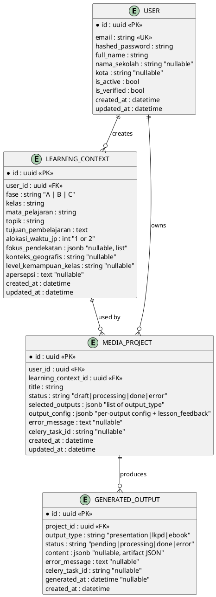
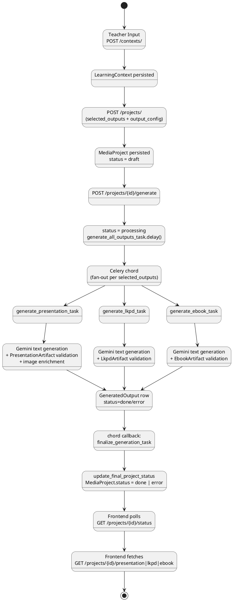
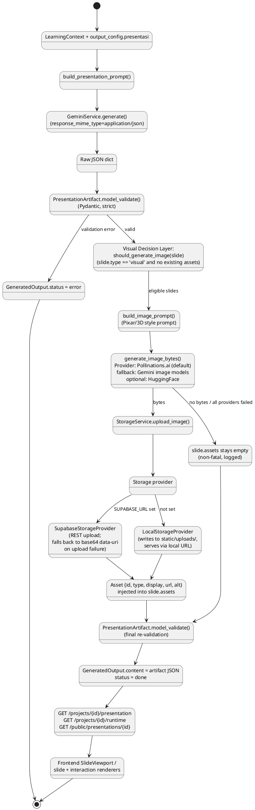
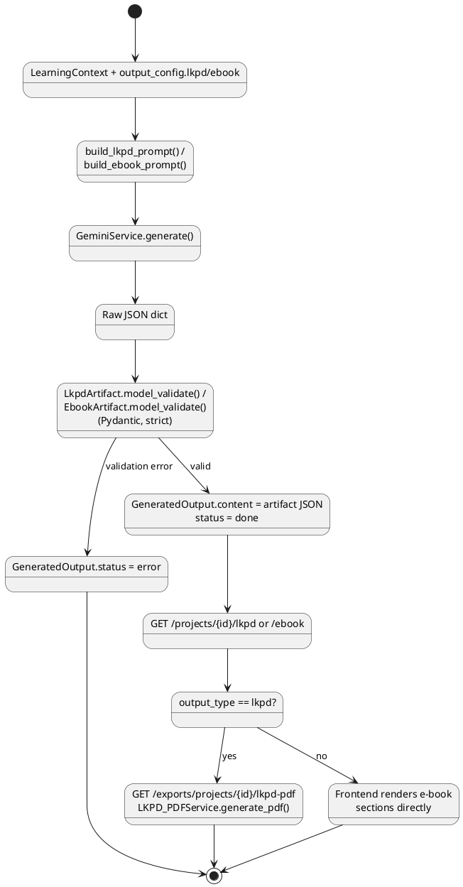
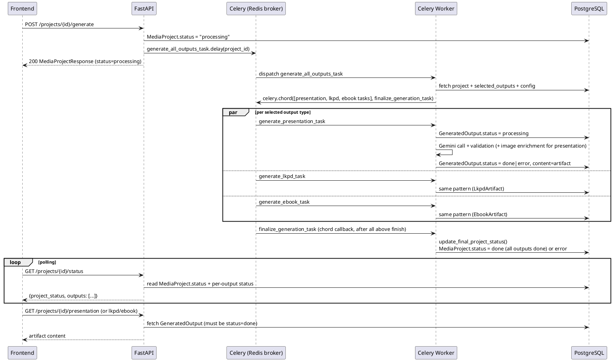

# KelasIn — ERD & AI Generation Pipeline

---

## PART 1 — Entity Relationship Diagram (ERD)

Source: `apps/api/app/models/*.py`, `apps/api/migrations/versions/0f87b4fbd53c_initial_schema.py`.

There is **one Alembic migration** in the repository. All persisted state lives in **4 tables**.
No additional tables exist for images/assets, TTS, TaRL, or exports — those features (documented
in Part 2) are stateless request/response services with no dedicated database entity.



### Entity Overview

| Entity | Responsibility |
|---|---|
| `USER` | Teacher account; holds credentials and profile fields (`nama_sekolah`, `kota`). Source: `app/models/user.py`. |
| `LEARNING_CONTEXT` | Tahap 1 input — the pedagogical parameters a teacher defines once and can reuse across projects (subject, topic, phase, local context). Source: `app/models/learning_context.py`. |
| `MEDIA_PROJECT` | Tahap 2/3 — one generation request: which outputs are selected (`selected_outputs`), their per-output configuration (`output_config`), and overall generation `status`. Source: `app/models/media_project.py`. |
| `GENERATED_OUTPUT` | One row per (project, output_type). Holds the AI-produced `content` (JSONB) and its own independent `status`, decoupled from the parent project's status. Source: `app/models/generated_output.py`. |

### Relationship Notes

- `USER 1—N LEARNING_CONTEXT` and `USER 1—N MEDIA_PROJECT`: both cascade-delete (`ondelete="CASCADE"`) when the user is removed.
- `LEARNING_CONTEXT 1—N MEDIA_PROJECT`: a single learning context can be reused by multiple projects (confirmed by the FK direction: `media_projects.learning_context_id → learning_contexts.id`). Cascade-deletes on context removal.
- `MEDIA_PROJECT 1—N GENERATED_OUTPUT`: one project can have up to 3 output rows (`presentation`, `lkpd`, `ebook`), one per selected type. Cascade-deletes on project removal.
- **Status is tracked at two independent levels**: `MediaProject.status` (overall) and `GeneratedOutput.status` (per output type). The project-level status is derived — `app/tasks/pipeline.py::update_final_project_status` sets it to `"done"` only if *all* of a project's `GeneratedOutput` rows are `"done"`, otherwise `"error"`.
- `MediaProject.output_config` is also where post-lesson feedback is stored, under the key `lesson_feedback` (written by `FeedbackHandlerService.submit_feedback`, `app/services/outputs/feedback_handler.py`) — there is no separate feedback table.
- No foreign key or table exists for images/assets. Generated image URLs are embedded directly inside `GeneratedOutput.content` (inside each slide's `assets` array) — asset storage is file/object storage, not a relational entity.

---

## PART 2 — AI Generation Pipeline

Source: `app/api/v1/endpoints/projects.py`, `app/services/projects/project_generator.py`,
`app/tasks/generate.py`, `app/tasks/pipeline.py`, `app/tasks/celery_app.py`.

### Overall flow (actual implementation)



Each of the 3 output types runs as an **independent Celery task** and can succeed or fail
independently — one output failing does not block or fail the others (confirmed: each
`_generate_output()` call has its own `try/except`, writes its own `GeneratedOutput.status`,
and commits separately).

---

### Presentation Pipeline (detailed)

Source: `app/services/prompts/presentation_prompt.py`, `app/services/prompts/presentation_templates.py`,
`app/schemas/presentation_artifact.py`, `app/services/ai/gemini_service.py`,
`app/services/ai/visual_decision_layer.py`, `app/services/ai/visual_asset_pipeline.py`,
`app/services/ai/image_generator.py`, `app/services/storage/*`, `app/tasks/generate.py`.



Notes on what is and isn't implemented here:

- **Image generation is implemented**, not just an abstraction. `app/services/ai/image_generator.py`
  actually calls out to real providers. The **default provider is Pollinations.ai** (no API key,
  FLUX model), with Gemini image models and HuggingFace as alternate/fallback providers selectable
  via `IMAGE_GENERATION_PROVIDER`.
- The **visual decision layer no longer filters by keyword** — the current implementation of
  `should_generate_image()` (`app/services/ai/visual_decision_layer.py`) generates an image for
  **every** slide with `type == "visual"` that doesn't already have assets. An earlier version of
  this function used an instructional-keyword allowlist to gate image generation more selectively;
  that gate has been removed in the current code.
- **Storage is a real abstraction with two concrete providers** (`app/services/storage/base.py`,
  `providers.py`, `storage_service.py`): `LocalStorageProvider` (filesystem, dev/fallback) and
  `SupabaseStorageProvider` (REST upload to Supabase Storage). Provider selection is automatic,
  based on whether `SUPABASE_URL` is set in the environment.
- **Image generation failure is non-fatal per slide**: `enrich_with_images()` catches exceptions
  per slide and continues; the artifact is re-validated and persisted even if zero images
  succeeded.
- The presentation prompt (`presentation_prompt.py` + `presentation_templates.py`) explicitly
  instructs Gemini to emit `assets: []` for visual slides and **forbids it from inventing image
  URLs** — asset injection is a backend-only step that happens *after* Gemini's text response.

---

### LKPD & E-book Pipeline

Source: `app/services/prompts/lkpd_prompt.py`, `app/services/prompts/ebook_prompt.py`,
`app/schemas/document_artifacts.py`, `app/tasks/generate.py`.



---

## AI Responsibility vs Application Responsibility

| Responsibility | Owner (as implemented) |
|---|---|
| Understanding teacher input (fase, topik, tujuan pembelajaran, konteks lokal) | AI (via prompt, `context_builder.py`) |
| Lesson/content composition (slide sequence, question sets, e-book sections) | AI |
| Output structure (JSON shape) | AI (instructed) + Backend (Pydantic schema, enforced) |
| Artifact validation | Backend (`PresentationArtifact` / `LkpdArtifact` / `EbookArtifact`, `Pydantic.model_validate`) |
| Deciding *whether* a slide gets an image | Backend (`visual_decision_layer.should_generate_image`, deterministic, not AI-decided) |
| Image pixel generation | External AI provider (Pollinations.ai / Gemini image models / HuggingFace) invoked by backend |
| Asset storage & URL issuance | Backend (`StorageService`, Local/Supabase providers) |
| Interaction rendering (choice/matching/sorting/reveal/drag_drop UI) | Frontend (`apps/web/src/features/presentation/components/interactions/*`) |
| Presentation runtime (navigation, touch, playback state) | Frontend |
| Persistence | Backend (PostgreSQL via SQLAlchemy) |
| PDF/offline export | Backend for LKPD (`LKPD_PDFService`, server-rendered PDF bytes); Frontend for other export paths (`lib/export/*.ts` — client-side HTML/PDF generation from already-fetched artifact data) |
| Audio narration (TTS) | Backend (`TTSService`, `edge-tts`), invoked on-demand per slide or arbitrary text — not part of the generation pipeline itself |
| Differentiated (TaRL) content | AI (separate prompt/service, `TaRLService`), validated by `DifferentiatedResponse` schema, **not persisted** (see below) |

This confirms the general framing: **AI produces structured learning content; the backend owns
validation, image/asset acquisition, and persistence; the frontend owns rendering and runtime
interaction.** The one nuance specific to this codebase is that *whether* to generate an image is
a deterministic backend decision (based on `slide.type`), not something the AI is trusted to gate
on its own.

---

## Async Generation (Celery + Redis)

Source: `app/tasks/celery_app.py`, `app/tasks/generate.py`, `app/tasks/pipeline.py`,
`app/services/projects/project_generator.py`.

Celery + Redis are real, wired dependencies (`CELERY_BROKER_URL`, `CELERY_RESULT_BACKEND` in
`app/core/config.py`), not placeholders.



Key implementation details:

- **Fan-out is a Celery `chord`**, not a blocking `group().get()` — the orchestrator
  (`generate_all_outputs_task`) dispatches the three per-output tasks and registers
  `finalize_generation_task` as the chord callback, which runs exactly once after all
  child tasks complete.
- Each per-output task (`generate_presentation_task`, `generate_lkpd_task`,
  `generate_ebook_task`) opens its **own new asyncio event loop** per invocation
  (`run_async()` in `app/tasks/generate.py`), and explicitly disposes the SQLAlchemy async
  engine's connection pool at the end of each call to avoid cross-loop connection reuse.
- **Per-output status** (`GeneratedOutput.status`) and **overall project status**
  (`MediaProject.status`) are tracked separately; the latter is derived from the former by
  `update_final_project_status()` only after all selected outputs finish (success or failure).
- The frontend learns of completion exclusively through **polling**
  `GET /projects/{id}/status` — there is no WebSocket/SSE push mechanism in the codebase.
- Re-triggering generation while `MediaProject.status == "processing"` is rejected with
  `409 Conflict` (`ProjectGeneratorService.trigger`).

---

## PART 3 - API Reference

Source: `app/api/v1/router.py`, `app/api/v1/endpoints/*.py`, `app/main.py`, `app/api/deps.py`,
`app/schemas/*.py`, `app/services/**/*.py`.

### API Base

All routers are mounted under a single prefix, read from `settings.API_V1_STR`
(`app/core/config.py`), whose actual default value is:

```
/api/v1
```

`app/main.py` mounts it as `app.include_router(api_router, prefix=settings.API_V1_STR)`. Two
routes exist outside this prefix: `GET /health` and `GET /` (both tagged `"System"`,
defined directly in `app/main.py`).

**Authentication mechanism**: `HTTPBearer` + JWT (`app/api/deps.py::get_current_user`). Every
endpoint that declares a `CurrentUser` dependency requires header `Authorization: Bearer
<access_token>` and returns `401 Unauthorized` (`"Token tidak valid atau sudah kedaluwarsa"`) if
the token is missing, invalid, expired, or belongs to an inactive user. The only endpoint with
no such dependency is `GET /public/presentations/{project_id}`.

---

### 4.1 Authentication

Router: `app/api/v1/endpoints/auth.py`, prefix `/auth`, tag `Auth`.

#### `POST /auth/register`
- **Auth**: None
- **Purpose**: Register a new teacher account.
- **Request** (`RegisterRequest`, `app/schemas/auth.py`):
  ```json
  {
    "email": "teacher@example.com",
    "password": "Passw0rd!",
    "full_name": "Bu Guru",
    "nama_sekolah": "SDN 1 Contoh",
    "kota": "Malang"
  }
  ```
  `email` must be a valid email; `password` 8–128 chars and must contain at least one uppercase,
  one lowercase, one digit, and one special character (`RegisterRequest.validate_password_strength`);
  `full_name` 2–255 chars; `nama_sekolah`/`kota` optional.
- **Response** `201 Created` (`UserResponse`):
  ```json
  {
    "id": "uuid",
    "email": "teacher@example.com",
    "full_name": "Bu Guru",
    "nama_sekolah": "SDN 1 Contoh",
    "kota": "Malang",
    "is_active": true
  }
  ```
- **Errors**: `409 Conflict` if the email is already registered (`AuthService.register_user`);
  `422 Unprocessable Entity` on schema validation failure (password rules, email format, etc.).

#### `POST /auth/login`
- **Auth**: None
- **Purpose**: Authenticate a teacher and issue JWT access/refresh tokens.
- **Request** (`LoginRequest`):
  ```json
  { "email": "teacher@example.com", "password": "Passw0rd!" }
  ```
- **Response** `200 OK` (`TokenResponse`):
  ```json
  { "access_token": "...", "refresh_token": "...", "token_type": "bearer" }
  ```
- **Errors**: `401 Unauthorized` if email/password is wrong (`"Email atau password salah"`);
  `403 Forbidden` if the account is inactive (`"Akun tidak aktif"`).

#### `GET /auth/me`
- **Auth**: Required
- **Purpose**: Return the profile of the currently authenticated teacher.
- **Request**: none.
- **Response** `200 OK` (`UserResponse`) — same shape as the register response.
- **Errors**: `401 Unauthorized` if the token is missing/invalid/expired.

---

### 4.2 Context API

Router: `app/api/v1/endpoints/contexts.py`, prefix `/contexts`, tag `Learning Contexts`.
All routes require auth and are scoped to `current_user.id` (`ContextService`,
`ContextRepository`).

| Method | Path |
|---|---|
| POST | `/contexts/` |
| GET | `/contexts/` |
| GET | `/contexts/{context_id}` |
| PUT | `/contexts/{context_id}` |
| DELETE | `/contexts/{context_id}` |

#### `POST /contexts/`
- **Auth**: Required
- **Purpose**: Create a new Learning Context (Tahap 1).
- **Request** (`LearningContextCreate`):
  ```json
  {
    "fase": "B",
    "kelas": "3&4",
    "mata_pelajaran": "IPAS",
    "topik": "Siklus Air",
    "tujuan_pembelajaran": "Siswa mampu menjelaskan proses siklus air.",
    "alokasi_waktu_jp": 1,
    "fokus_pendekatan": ["visual_gambar"],
    "konteks_geografis": "pesisir",
    "level_kemampuan_kelas": "campuran",
    "apersepsi": "Minggu lalu belajar tentang cuaca"
  }
  ```
  `fase`/`kelas` are validated for consistency (`A↔1&2`, `B↔3&4`, `C↔5&6`) — a mismatch raises a
  `422` model-validation error. All fields other than `fase`, `kelas`, `mata_pelajaran`, `topik`,
  `tujuan_pembelajaran`, `alokasi_waktu_jp` are optional.
- **Response** `201 Created` (`LearningContextResponse`): same fields as the request plus
  `id`, `user_id`, `created_at`, `updated_at` (ISO datetime strings).
- **Errors**: `422 Unprocessable Entity` on schema/enum/consistency validation failure.

#### `GET /contexts/`
- **Auth**: Required
- **Purpose**: List the current teacher's learning contexts, paginated.
- **Request**: query params `skip` (default 0, ≥0), `limit` (default 20, 1–100).
- **Response** `200 OK`: `list[LearningContextResponse]`.

#### `GET /contexts/{context_id}`
- **Auth**: Required
- **Response** `200 OK`: `LearningContextResponse`.
- **Errors**: `404 Not Found` (`"Konteks pembelajaran tidak ditemukan"`) if not found or not
  owned by the current user, or if `context_id` isn't a valid UUID.

#### `PUT /contexts/{context_id}`
- **Auth**: Required
- **Purpose**: Partial update (`LearningContextUpdate` — every field optional; only fields
  present in the payload are changed, via `model_dump(exclude_unset=True)`).
- **Response** `200 OK`: `LearningContextResponse`.
- **Errors**: `404 Not Found` (same as above); `422` on validation failure.

#### `DELETE /contexts/{context_id}`
- **Auth**: Required
- **Purpose**: Delete the context. Cascades to delete all `MediaProject` rows referencing it
  (`ondelete="CASCADE"` at the DB level).
- **Response** `204 No Content`.
- **Errors**: `404 Not Found`.

---

### 4.3 Project API

Router: `app/api/v1/endpoints/projects.py`, prefix `/projects`, tag `Media Projects`. All routes
require auth and are scoped to `current_user.id`.

| Method | Path |
|---|---|
| POST | `/projects/` |
| GET | `/projects/` |
| GET | `/projects/{project_id}` |
| PUT | `/projects/{project_id}/config` |
| DELETE | `/projects/{project_id}` |
| POST | `/projects/{project_id}/generate` |
| GET | `/projects/{project_id}/status` |
| GET | `/projects/{project_id}/workspace` |
| GET | `/projects/{project_id}/summary` |

There is no plain `PUT /projects/{project_id}` — only the `/config` sub-route updates a project.

#### `POST /projects/`
- **Auth**: Required
- **Purpose**: Create a project (Tahap 2), tying it to an existing `LearningContext`.
- **Request** (`MediaProjectCreate`):
  ```json
  {
    "learning_context_id": "uuid",
    "title": "Siklus Air - Kelas 3B",
    "selected_outputs": ["presentation", "lkpd"],
    "output_config": {
      "presentasi": { "gaya_visual": "cute_3d", "mode_dinamika": "seimbang" },
      "lkpd": { "jumlah_soal": 10 }
    }
  }
  ```
  Note the `output_config` sub-keys are `presentasi` / `lkpd` / `ebook` (Indonesian), while
  `selected_outputs` values are `presentation` / `lkpd` / `ebook` (English for the first one) —
  this naming difference exists as-is in `app/schemas/media_project.py`.
- **Response** `201 Created` (`MediaProjectResponse`):
  ```json
  {
    "id": "uuid",
    "user_id": "uuid",
    "learning_context_id": "uuid",
    "title": "Siklus Air - Kelas 3B",
    "status": "draft",
    "selected_outputs": ["presentation", "lkpd"],
    "output_config": { "presentasi": {...}, "lkpd": {...} },
    "error_message": null,
    "created_at": "...",
    "updated_at": "..."
  }
  ```
- **Errors**: `404 Not Found` if `learning_context_id` doesn't exist or isn't owned by the
  current user; `422` on schema validation failure.

#### `GET /projects/`
- **Auth**: Required. Query params `skip`/`limit` as in Context API.
- **Response** `200 OK`: `list[MediaProjectResponse]`.

#### `GET /projects/{project_id}`
- **Response** `200 OK`: `MediaProjectResponse`.
- **Errors**: `404 Not Found` (`"Project tidak ditemukan"`), including when `project_id` is not a
  valid UUID (`ProjectCRUDService.validate_uuid` converts a `ValueError` into `404`, not `422`).

#### `PUT /projects/{project_id}/config`
- **Purpose**: Update `title` / `selected_outputs` / `output_config` (`MediaProjectUpdateConfig`,
  all fields optional).
- **Response** `200 OK`: `MediaProjectResponse`.
- **Errors**: `404 Not Found`; `409 Conflict` (`"Tidak bisa mengubah konfigurasi saat proses
  generate sedang berjalan"`) if `status == "processing"`.

#### `DELETE /projects/{project_id}`
- **Purpose**: Delete the project. Cascades to delete all its `GeneratedOutput` rows.
- **Response** `204 No Content`.
- **Errors**: `404 Not Found`.

#### `POST /projects/{project_id}/generate`
- **Purpose**: Trigger asynchronous AI generation for every output type in
  `selected_outputs`.
- **Request**: no body.
- **Asynchronous behavior**: sets `MediaProject.status = "processing"`, clears
  `error_message`, then calls `generate_all_outputs_task.delay(project_id)` (Celery, via Redis
  broker) and stores the returned task id in `MediaProject.celery_task_id`. The HTTP response
  returns **immediately** — it does not wait for generation to finish.
- **Response** `200 OK` (`MediaProjectResponse`) with `status: "processing"`.
- **Errors**: `404 Not Found`; `409 Conflict` (`"Generate sedang berjalan untuk project ini"`) if
  already `processing`; `422 Unprocessable Entity` (`"Pilih minimal 1 jenis output untuk
  digenerate"`) if `selected_outputs` is empty.
- **Relationship with `/status`**: the caller is expected to poll `GET
  /projects/{project_id}/status` afterward to observe per-output and overall progress — there is
  no push notification.

#### `GET /projects/{project_id}/status`
- **Purpose**: Poll overall and per-output generation status.
- **Response** `200 OK` (plain `dict`, not a declared Pydantic `response_model`):
  ```json
  {
    "project_id": "uuid",
    "project_status": "processing",
    "outputs": [
      { "output_type": "presentation", "status": "done", "generated_at": "..." },
      { "output_type": "lkpd", "status": "processing", "generated_at": null }
    ],
    "error_message": null
  }
  ```
- **Errors**: `404 Not Found`.

#### `GET /projects/{project_id}/workspace`
- **Purpose**: Aggregated dashboard data ("Ruang Projek") — project info, learning context
  summary, per-output availability/status, `selected_outputs`, suggested `quick_actions`, and any
  stored `lesson_feedback`. Returned by `ProjectWorkspaceService.get_workspace` as a plain `dict`
  (no declared `response_model`).
- **Errors**: `404 Not Found`.

#### `GET /projects/{project_id}/summary`
- **Purpose**: "Smart Summary" (Tahap 3) — a generated Indonesian-language text summary plus a
  `details` object echoing the context/config, produced by `ProjectSummaryService` (no AI call
  involved — this summary is built from template strings and stored config, not from Gemini).
  Returned as a plain `dict`.
- **Errors**: `404 Not Found`.

---

### 4.4 Output API

Router: `app/api/v1/endpoints/outputs.py`, prefix `/projects`, tag `Generated Outputs`. All
routes require auth and are scoped to `current_user.id` via the parent project.

| Method | Path |
|---|---|
| GET | `/projects/{project_id}/presentation` |
| GET | `/projects/{project_id}/lkpd` |
| GET | `/projects/{project_id}/ebook` |
| PATCH | `/projects/{project_id}/{output_type}` |
| GET | `/projects/{project_id}/runtime` |
| POST | `/projects/{project_id}/feedback` |

#### `GET /projects/{project_id}/presentation` / `/lkpd` / `/ebook`
- **Purpose**: Retrieve one `GeneratedOutput`'s content by type. All three routes call the same
  `OutputViewerService.get_by_type(db, project_id, user_id, output_type)`.
- **Response wrapping**: content is wrapped under a **`content`** key, not `artifact`:
  ```json
  {
    "project_id": "uuid",
    "output_type": "presentation",
    "content": { "version": "0.2", "meta": {...}, "slides": [...] },
    "generated_at": "2026-09-05T10:00:00+00:00"
  }
  ```
  This is a plain `dict` response (no declared `response_model`). For `presentation`, `content`
  is the raw persisted `PresentationArtifact` JSON (including `version`); for `lkpd`/`ebook` it is
  the raw persisted `LkpdArtifact`/`EbookArtifact` JSON respectively.
- **Errors**: `404 Not Found` if the project doesn't exist or the output row doesn't exist yet;
  `425 Too Early` (`"Output '...' masih dalam proses generate AI"`) if `GeneratedOutput.status ==
  "processing"`; `500 Internal Server Error` (`"Gagal menghasilkan {type}: {error_message}"`) if
  `status == "error"`.

#### `PATCH /projects/{project_id}/{output_type}`
- **Purpose**: Manually edit an already-generated output's content.
- **Request**: raw `dict[str, Any]` — **no Pydantic schema validates this payload**. If the
  payload contains a `"content"` key whose value is a `dict`, that dict is shallow-merged
  (`dict.update`) onto the existing `content`; otherwise, the entire payload **replaces**
  `content` outright.
- **Response** `200 OK`:
  ```json
  {
    "project_id": "uuid",
    "output_type": "lkpd",
    "message": "Konten berhasil diperbarui",
    "content": { ...merged or replaced content... }
  }
  ```
- **Errors**: `400 Bad Request` if `output_type` is not one of `presentation`/`lkpd`/`ebook`;
  `404 Not Found` if the project doesn't exist or the output isn't yet `status == "done"`.
- **Important behavior**: unlike the generation path (`app/tasks/generate.py`), this endpoint
  does **not** re-validate the resulting content against `PresentationArtifact` /
  `LkpdArtifact` / `EbookArtifact` after the merge/replace — it is possible to PATCH a
  previously valid artifact into a shape that would fail schema validation.

#### `GET /projects/{project_id}/runtime`
- **Purpose**: Authenticated IFP TV playback payload for the current teacher's presentation.
- **Response wrapping**: content is wrapped under an **`artifact`** key (different from the
  `/presentation` endpoint's `content` key):
  ```json
  {
    "runtime_id": "uuid",
    "mode": "interactive_tv",
    "artifact": { "version": "0.2", "meta": {...}, "slides": [...] },
    "ifp_settings": {
      "optimized_for": "interactive_flat_panel",
      "touch_target_min_size": "80px",
      "font_scale": "large",
      "contrast": "high"
    }
  }
  ```
- **Errors**: `404 Not Found` if the project doesn't exist, or if there is no `presentation`
  output with `status == "done"`.

#### `POST /projects/{project_id}/feedback`
- **Purpose**: Record post-lesson feedback. Stored inside `MediaProject.output_config` under the
  key `lesson_feedback` — **not** a `GeneratedOutput` row.
- **Request**: raw `dict[str, Any]`, no schema. Recognized keys: `rating` (int, must be 1–5 if
  present), `catatan`, `siswa_aktif`, `kendala`.
- **Response** `200 OK`:
  ```json
  {
    "project_id": "uuid",
    "message": "Terima kasih atas feedbacknya. Data berhasil disimpan untuk evaluasi.",
    "feedback": {
      "rating": 5,
      "catatan": "...",
      "siswa_aktif": true,
      "kendala": "...",
      "submitted_at": "2026-09-06T04:00:00+00:00"
    }
  }
  ```
- **Errors**: `404 Not Found`; `422 Unprocessable Entity` (`"Rating harus berupa angka antara 1
  sampai 5"`) if `rating` is present but out of range or not an int.

---

### 4.5 Public API

Router: `app/api/v1/endpoints/public.py`, prefix `/public`, tag `Public Viewer`.

#### `GET /public/presentations/{project_id}`
- **Authentication**: **None.** This is the only route in the codebase with no `CurrentUser`
  dependency.
- **Response**:
  ```json
  {
    "project_id": "uuid",
    "artifact": { "version": "0.2", "meta": {...}, "slides": [...] }
  }
  ```
  Wrapped under **`artifact`**, matching `/runtime`'s wrapper — not `content`.
- **Teacher information exposed**: **None.** `RuntimeViewerService.get_public_presentation`
  fetches the `MediaProject` only to reach its `learning_context` for `meta` fallback fields
  (`mata_pelajaran`, `topik`, `fase`); it never returns `user_id`, `title`, `output_config`,
  `error_message`, or any other teacher/project-management field. No ownership check is
  performed — any caller who knows or guesses a `project_id` can reach this endpoint (there is no
  separate public share-token or slug; the project's own UUID doubles as the public identifier).
- **Relationship with `PresentationArtifact`**: the `artifact` value is exactly the same
  `PresentationArtifact`-shaped structure returned by `/runtime` and `/presentation` — extracted
  by the same shared helper (`_extract_artifact()` in `app/services/outputs/runtime_viewer.py`)
  used by both the authenticated and public paths.
- **Errors**: `404 Not Found` if the project doesn't exist, or if there is no `presentation`
  output with `status == "done"`.
- **Intended usage** (per source comments in `public.py`): allow an Interactive Flat Panel (IFP)
  device in a classroom to display a presentation without requiring the device to hold or manage
  a teacher's login session.

---

### 4.6 Other Endpoints (Exports, Narration, Differentiation)

These three routers exist in `app/api/v1/router.py` alongside the ones detailed above. They are
included here for completeness of the API surface, though they were not part of the requested
4.1–4.5 breakdown.

#### `GET /exports/projects/{project_id}/lkpd-pdf`
- Router: `app/api/v1/endpoints/exports.py`, prefix `/exports`, tag `Exports`.
- **Auth**: Required.
- **Purpose**: Download the project's LKPD as a print-ready A4 PDF, generated server-side via
  `fpdf2` (`LKPD_PDFService.generate_pdf`).
- **Response**: binary `application/pdf`, `Content-Disposition: attachment`.
- **Errors**: `404 Not Found` if the LKPD output isn't available/done; `500 Internal Server
  Error` if PDF generation raises.
- **Implementation note**: `LKPD_PDFService.generate_pdf` reads `lkpd_data.get("header", {})` and
  `lkpd_data.get("soal", [])` — keys from a pre-v0.1 LKPD shape. The content actually persisted by
  the generation pipeline is `LkpdArtifact`'s `{version, meta, sections}` shape, which has neither
  key. This does not raise an error; it silently produces a PDF with blank identity fields and no
  rendered questions.

#### `POST /narrations/synthesize`
- Router: `app/api/v1/endpoints/narrations.py`, prefix `/narrations`, tag `Audio Narration`.
- **Auth**: None (no `CurrentUser` dependency on this specific route).
- **Purpose**: Convert arbitrary text (1–2000 chars) into streamed MP3 via `edge-tts`.
- **Response**: `StreamingResponse`, `audio/mpeg`.

#### `GET /narrations/slides/{project_id}/{slide_id}`
- **Auth**: Required.
- **Purpose**: Synthesize narration audio for one presentation slide, using
  `speaker_script` → `content` → `title` as fallback text source, in that order.
- **Response**: `StreamingResponse`, `audio/mpeg`.
- **Errors**: `404 Not Found` if the slide id doesn't exist in the presentation's `slides`;
  `400 Bad Request` if the resolved slide has no text to read at all.

#### `POST /projects/{project_id}/differentiate`
- Router: `app/api/v1/endpoints/differentiations.py`, prefix `/projects`, tag `Differentiated
  Learning (TaRL)`.
- **Auth**: Required.
- **Purpose**: Generate a 3-tier (Perintis/Cakap/Mahir) differentiated learning plan directly
  from the project's `LearningContext`, via a dedicated Gemini prompt (`TaRLService`).
- **Response**: `DifferentiatedResponse` (declared `response_model`).
- **Not persisted**: every call re-generates via Gemini; there is no `GeneratedOutput.output_type`
  value or database row for TaRL content — the response is computed and returned, not stored.
- **Errors**: `404 Not Found` if the project/context isn't found (raised as `ValueError`, caught
  and converted to `404` in the endpoint); `500 Internal Server Error` on any other failure.

---

### 4.7 API Endpoint Summary

| Domain | Method | Endpoint | Auth | Purpose |
|---|---|---|---|---|
| Auth | POST | `/auth/register` | No | Register a new teacher account |
| Auth | POST | `/auth/login` | No | Authenticate and obtain JWT tokens |
| Auth | GET | `/auth/me` | Yes | Get current teacher profile |
| Context | POST | `/contexts/` | Yes | Create a learning context |
| Context | GET | `/contexts/` | Yes | List learning contexts |
| Context | GET | `/contexts/{context_id}` | Yes | Get one learning context |
| Context | PUT | `/contexts/{context_id}` | Yes | Partially update a learning context |
| Context | DELETE | `/contexts/{context_id}` | Yes | Delete a learning context (cascades to projects) |
| Project | POST | `/projects/` | Yes | Create a media project |
| Project | GET | `/projects/` | Yes | List media projects |
| Project | GET | `/projects/{project_id}` | Yes | Get one media project |
| Project | PUT | `/projects/{project_id}/config` | Yes | Update project title/outputs/config |
| Project | DELETE | `/projects/{project_id}` | Yes | Delete a project (cascades to outputs) |
| Project | POST | `/projects/{project_id}/generate` | Yes | Trigger async AI generation |
| Project | GET | `/projects/{project_id}/status` | Yes | Poll generation status |
| Project | GET | `/projects/{project_id}/workspace` | Yes | Get aggregated project dashboard data |
| Project | GET | `/projects/{project_id}/summary` | Yes | Get Smart Summary (Tahap 3) |
| Output | GET | `/projects/{project_id}/presentation` | Yes | Get presentation content |
| Output | GET | `/projects/{project_id}/lkpd` | Yes | Get LKPD content |
| Output | GET | `/projects/{project_id}/ebook` | Yes | Get e-book content |
| Output | PATCH | `/projects/{project_id}/{output_type}` | Yes | Manually edit output content |
| Output | GET | `/projects/{project_id}/runtime` | Yes | Get authenticated IFP TV runtime payload |
| Output | POST | `/projects/{project_id}/feedback` | Yes | Submit post-lesson feedback |
| Public | GET | `/public/presentations/{project_id}` | No | Public read-only presentation viewer |
| Exports | GET | `/exports/projects/{project_id}/lkpd-pdf` | Yes | Download LKPD as print-ready PDF |
| Narration | POST | `/narrations/synthesize` | No | Synthesize arbitrary text to speech |
| Narration | GET | `/narrations/slides/{project_id}/{slide_id}` | Yes | Stream narration audio for one slide |
| Differentiation | POST | `/projects/{project_id}/differentiate` | Yes | Generate 3-tier TaRL learning plan (not persisted) |

---